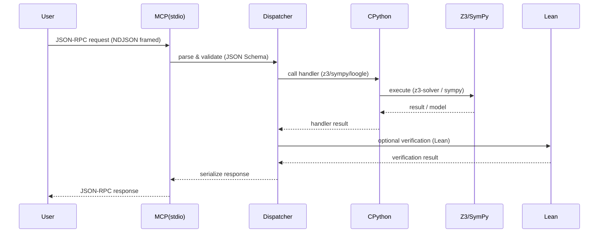

# Architecture

Overview
- C++ MCP stdio core: JSON-RPC 2.0 over stdio with NDJSON framing (one JSON object per line); handles parsing, request routing, timeouts, cancellation, and structured logging.
- Dispatcher / Worker pool: routes method calls to handler threads; enforces resource limits and per-job timeouts.
- CPython embed: C++ embeds CPython; calls into Cython-built extension modules for z3 and sympy.
- Lean runner: creates temp .lean files, invokes local `lean` process, captures stdout/stderr and exit codes.
- Sandbox manager: subprocess timeouts, OS-level resource caps (Windows Job Objects / Linux cgroups) and optional Docker runner for strong isolation.
- Clients / adapters: TypeScript client stubs generated from JSON Schema; XML or other adapters optional.

Sequence (mermaid)

Dataflow & lifecycle
- Request arrives on stdin, parsed and validated against JSON Schema.
- Dispatcher enqueues job; worker thread spawns sandboxed subprocess or calls embedded Python.
- Temporary artifacts (e.g., .lean files) are created in a per-job temp dir and deleted after job completion or on timeout.
- Results include structured metadata: status, stdout/stderr, exit_code, runtime_ms, and solver stats.

Concurrency & resource management
- Worker pool with configurable size; per-job timeouts and cancellation tokens.
- Enforce memory/CPU limits via OS primitives; optional Docker execution for untrusted code.
- Limit message size and enforce sane defaults to prevent resource exhaustion.

Error model & observability
- Errors map to JSON-RPC error objects with machine-friendly codes and human messages.
- Structured logs (spdlog/fmt) and optional metrics export (Prometheus) for long runs.
- Instrumentation points: request enqueue, start, handler start/stop, subprocess exit, verification pass/fail.

Extensibility
- Handlers implement a simple interface: (request_json) -> response_json.
- Add new backends by implementing a Cython extension or a subprocess adapter and registering the method name.
- API schemas live in docs/API_SCHEMA/ and are the source of truth for TS client generation.

Notes
- Keep the core protocol stable (JSON-RPC + NDJSON); provide language-specific adapters rather than changing the wire format.
- Prefer pip-installed `z3-solver` and `sympy` for Python handlers.
